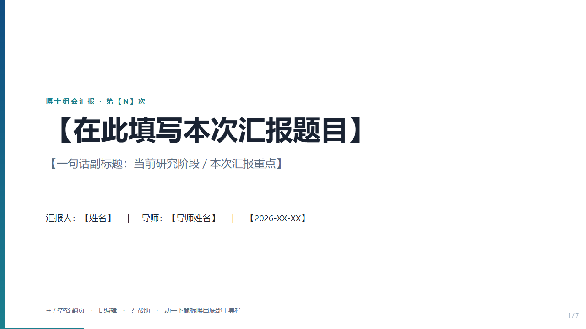
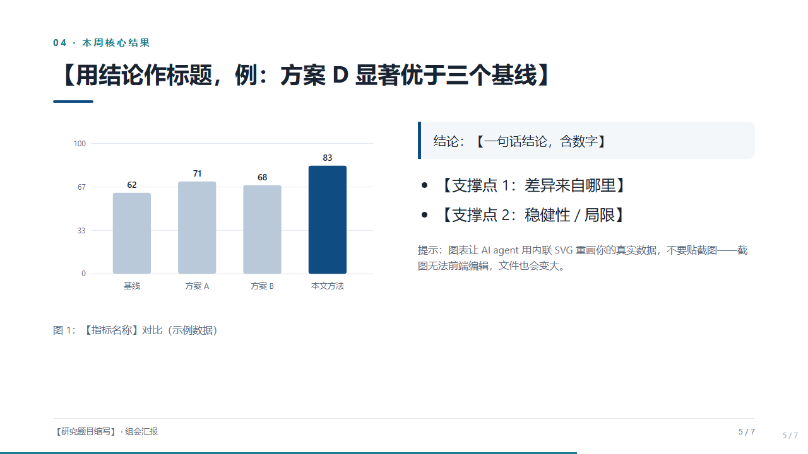

# agent-deck

**一个 HTML 文件：自己放映、自己编辑、自己导出像素级 PDF。** 
AI agent 时代的幻灯片——源文件 = 播放器 = 编辑器。

[English](README.md)&nbsp;·&nbsp;简体中文&nbsp;·&nbsp;[한국어](README.ko.md)

**[▶ 在线 Demo](https://dengyufan0.github.io/agent-deck/template.html)** — 打开后按 <kbd>?</kbd>

---

> 本页与各语言译文若有出入，以中文文档（本页及 PROMPT.md / METHODOLOGY.md）为正典。

## 为什么这能改变 PPT 汇报的格局

| 维度 | PowerPoint (.pptx) | agent-deck (.html) |
|------|-------------------|--------------------|
| **AI agent 修改** | 二进制黑盒，须借助工具链 | 纯文本，任何 agent 一轮对话整文件读写 |
| **会中修改** | 退出放映 → 改 → 再放映 | 按 <kbd>E</kbd> 当场改在片子上 |
| **版本管理** | 靠文件名自觉 | 版本记录内嵌文件中，文件名自动带版本号 |
| **分发归档** | 对方没装 Office / 缺字体就走样 | 任何浏览器断网可开；PDF 快照百分百保真 |

## 能力清单

- **放映** — 16:9（1280×720），键盘翻页、全屏、`#5` 深链；放映时工具栏**连同鼠标光标一起自动隐藏**，观众只看得到幻灯片；
- **现场编辑** — 按 <kbd>E</kbd> 每页可直接点击修改；粘贴强制转纯文本；改动自动暂存 localStorage，重开提示恢复；内容超高会红框警告（否则 PDF 会无声裁掉）；
- **版本内建** — 「保存新版本」下载 `标题_v02_日期.html`，修改说明写入内嵌版本记录；<kbd>Ctrl</kbd>+<kbd>S</kbd> 已拦截（浏览器原生「另存网页」会无声丢掉你的修改）；
- **一键 PDF** — `window.print()` + `@page` 恰好等于 PPT 16:9 页面：一片一页、隐藏 UI、保留背景、无末尾空白页，零库依赖；
- **Agent 原生** — 一份成文契约（[PROMPT.md](PROMPT.md)）让**任何** AI agent（Claude / ChatGPT / Gemini / DeepSeek…）都能生成或修改合规文件。契约即接口。

## 一分钟上手

1. 下载 [template.html](template.html)，用 Chrome/Edge 打开——这就是一份能直接用的汇报模板；
2. 按 <kbd>→</kbd> 翻页，<kbd>F</kbd> 全屏，动一下鼠标唤出底部工具栏；
3. 按 <kbd>E</kbd> 编辑，点「保存新版本」→ 得到带版本记录的新文件；
4. 点「导出 PDF」→ 打印对话框选「另存为 PDF」→ 逐页 16:9 的 PDF。

## 用任何 AI agent 生成新汇报

[PROMPT.md](PROMPT.md) 提供三段即贴即用的提示词（英文版见 [PROMPT.en.md](PROMPT.en.md)，**以中文契约为正典**）：

- **A 段 · 从零生成**：契约 + 你的大纲，粘给任何聊天型 agent（组会/答辩/评审/课程展示任意场景）；
- **B 段 · 增量修改**（日常主用）：把现有 `vN.html` 连同 B 段发给 agent；
- **C 段 · 从旧 PPT 迁移**：粘贴旧 PPT 的逐页文字。

生成后跑 PROMPT.md 文末的 **60 秒验收清单**，不合格条目原文丢回给 agent 让它修。

## 幻灯片长什么样

图表一律内联 SVG——可当场编辑、文件极小、不贴位图截图。

## 装成 Claude Code skill

把 [`skill/`](skill/) 复制到 `~/.claude/skills/agent-deck/`，然后说 `/agent-deck`。skill 会以模板为基底生成，并在交付前自动验证（脚本完整性、翻页、暂存、序列化、零外链）。

## 文件清单

| 文件 | 作用 |
|------|------|
| [template.html](template.html) | 参考实现 + 可直接用的模板（也是给 agent 看的"标准答案"） |
| [PROMPT.md](PROMPT.md) | 契约 + 三段提示词 + 验收清单（**正典，中文**） |
| [PROMPT.en.md](PROMPT.en.md) | 契约英文版 |
| [METHODOLOGY.md](METHODOLOGY.md) | 方法论全文：技术定案理由、工作流、已知坑、扩展模块 |
| [DESIGN.md](DESIGN.md) | 视觉规范（动 UI 前先读） |
| [skill/SKILL.md](skill/SKILL.md) | Claude Code skill |

## 纪律（只记三条）

1. **文件才是真身**：浏览器暂存只是安全网，会后立刻「保存新版本」落盘；
2. **零依赖是红线**：任何版本都不得引入 CDN / 外部字体 / 位图截图；
3. **导 PDF 认准 Chrome/Edge**，勾「背景图形」、关「页眉和页脚」。

## License

[MIT](LICENSE) — 随意使用、修改、传播；欢迎把它带进你的组会、团队周会、任何还在被 PPT 折磨的地方。
